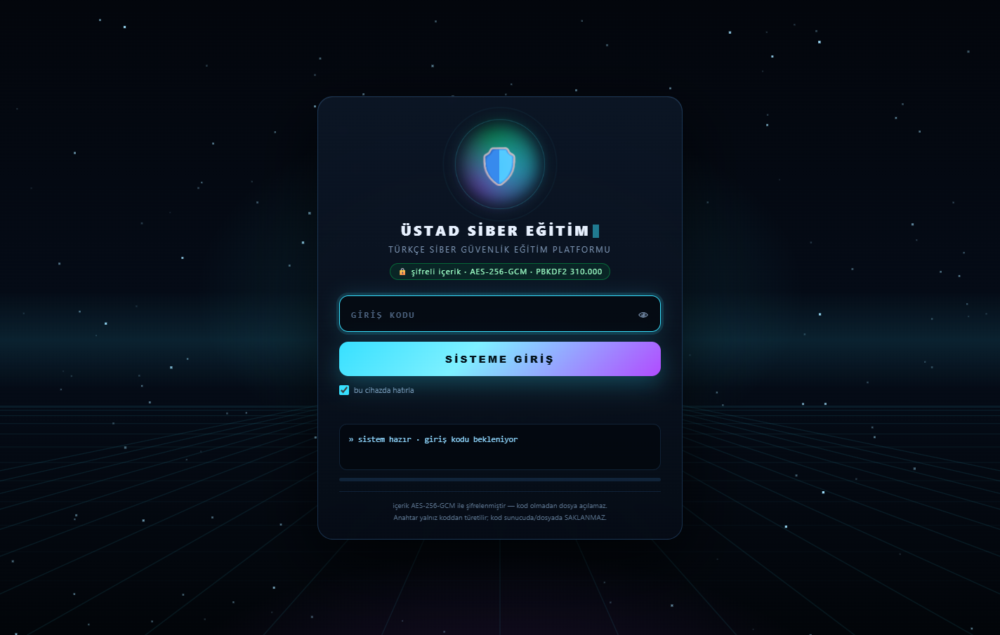
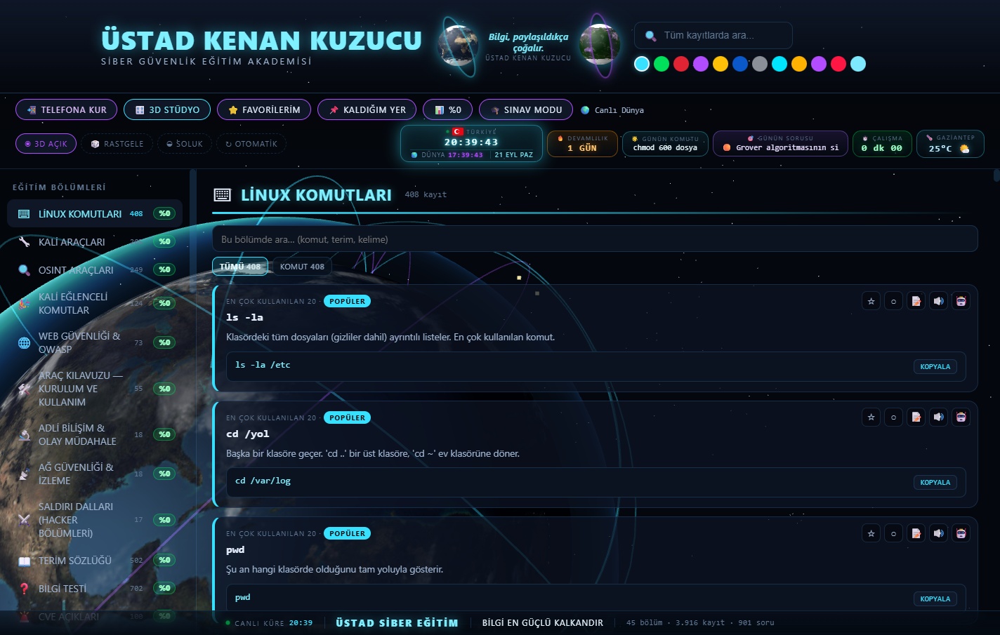
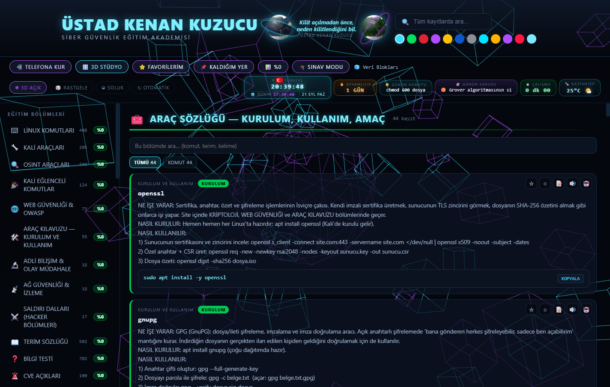
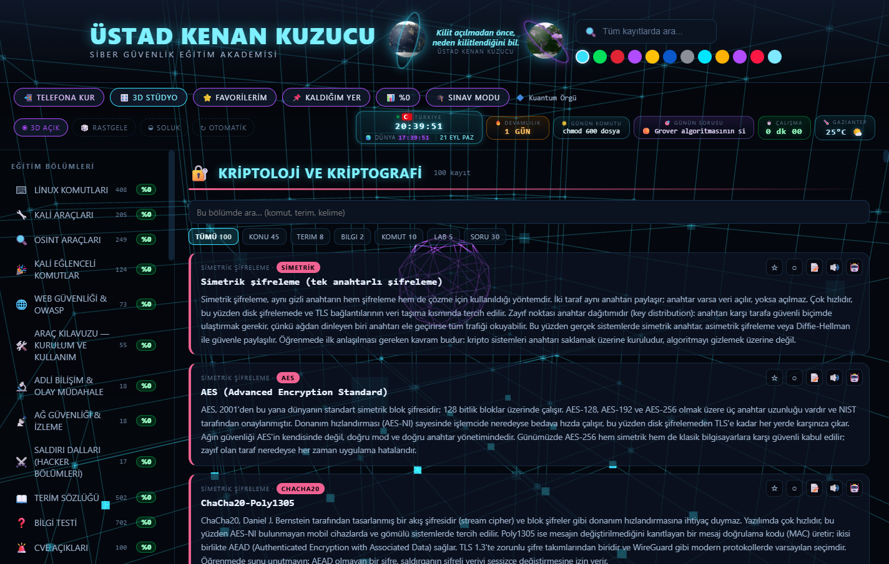
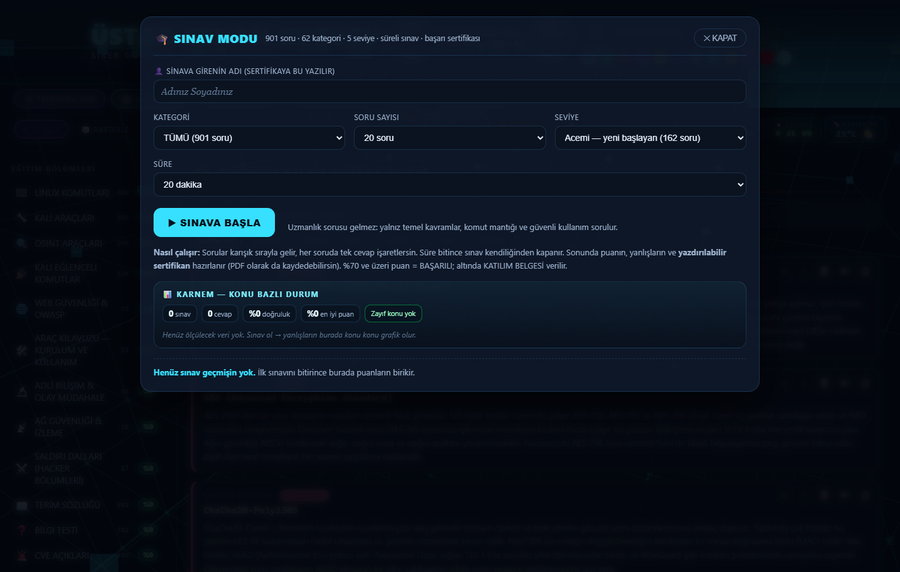
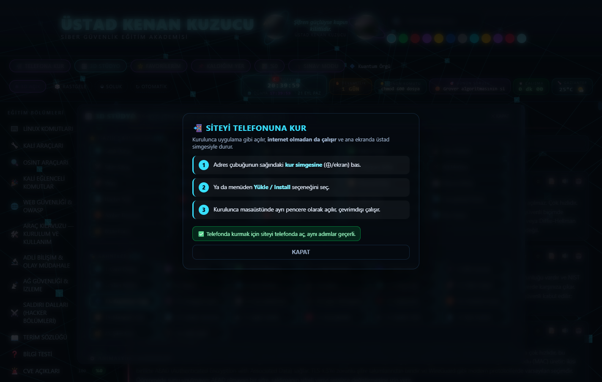
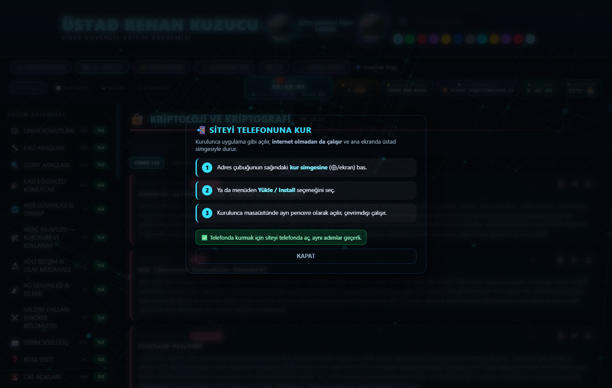

# 🛡️ ÜSTAD SİBER EĞİTİM

### Sıfırdan başlayanın da, ilerleyenin de kullanacağı Türkçe siber güvenlik eğitim platformu

**45 bölüm · 3.916 kayıt · 901 seviyeli soru · 26 sahneli 3D stüdyo · 12 tema**

---

## 📥 Uygulama (APK) indir

İki sürüm hazır — ikisi de **aynı imza anahtarıyla** imzalandı, içerik paketin içinde şifreli olarak gömülüdür (giriş kodu olmadan açılmaz, internet olmadan çalışır).

| Sürüm | Kime | İndir |
| :--- | :--- | :--- |
| 📱 **CEP TELEFONU** | dokunmatik telefon / tablet | [USTAD-SIBER-EGITIM-CEP.apk](apk/USTAD-SIBER-EGITIM-CEP.apk) · 4,7 MB |
| 📺 **TV BOX** | Android TV kutusu / akıllı TV (kumandalı, yatay ekran) | [USTAD-SIBER-EGITIM-TV.apk](apk/USTAD-SIBER-EGITIM-TV.apk) · 4,7 MB |

Kurulum ve kumanda tuşları: [apk/KURULUM-OKU-BENI.txt](apk/KURULUM-OKU-BENI.txt)

> TV sürümünde kumanda **okları** ekrandaki mavi imleci gezdirir, **OK** tıklar, **KANAL ▲▼** sayfayı kaydırır, **MENÜ** imleci gizler.

## 📸 Ekran görüntüleri

Arayüzden kareler — profil fotoğrafı gizlenerek alınmıştır.

|  |  |
| :---: | :---: |
| **🔐 Giriş perdesi**  | **🏠 Ana sayfa**  |
| **🧰 Araç sözlüğü**  | **🔑 Kriptoloji**  |
| **🎯 Sınav paneli**  | **🎬 3D stüdyo**  |

| **🌍 CANLI DÜNYA sahnesi** |
| :---: |
|  |

## 🔒 Güvenlik

| | |
|---|---|
| 🔐 **Giriş perdesi** | Animasyonlu kilit ekranı · 5 hatalı denemede 60 saniye kilit |
| 🧊 **Şifreli içerik** | Eğitim verisi (`veri.kilit`) **AES-256-GCM** ile şifrelidir |
| 🔑 **Anahtar türetme** | PBKDF2-SHA256 · 310.000 tur · anahtar yalnızca giriş kodundan üretilir |
| 🚫 **Kod saklanmaz** | Giriş kodu ne depoda ne sunucuda tutulur |

Depoda yalnızca uygulama dosyaları bulunur; eğitim içeriği şifreli kutu olarak durur ve
giriş kodu olmadan okunamaz.

---

## ✨ Ne var içinde?

| | |
|---|---|
| 🧠 **45 bölüm** | Linux komutları, Kali araçları, OSINT, web güvenliği & OWASP, ağ güvenliği, adli bilişim, CVE açıkları, gerçek vakalar, saldırı senaryoları, laboratuvarlar, kriptoloji, parola & kimlik, sistem sertleştirme, zararlı yazılım, bulut & konteyner, insan tarafı ve daha fazlası |
| 🎯 **901 seviyeli soru** | 🟢 ACEMİ · 🔵 ORTA · 🟡 İLERİ · 🟠 UZMAN · 🟣 MASTER · KARIŞIK — 62 kategori. **Yeni başlayana uzmanlık sorusu sorulmaz** (varsayılan: ACEMİ) |
| 🏆 **Sınav + sertifika** | Süreli sınav, puan, yanlışların açıklaması, **yazdırılabilir sertifika** (sertifikaya sınava girenin adı yazılır) |
| 📊 **Karnem** | Konu bazlı renkli grafik: nerede güçlüsün, nerede zayıfsın |
| 🧰 **Araç sözlüğü** | Her araç için üç soru: **ne işe yarar · nasıl kurulur · nasıl kullanılır** (44 araç, komut örnekleriyle) |
| 🎮 **3D Stüdyo** | 26 sahne (CANLI DÜNYA gerçek uydu dokusuyla, Kuantum Örgü, Kod Yağmuru, Radar, Galaksi…) + 26 hazır şablon + 12 tema |
| 🎨 **Kişisel katman** | ⭐ favori · ○ okundu · 📝 not · 🔊 sesli okuma · 📌 kaldığım yer · 🎯 zayıf konularım |
| 📡 **Çevrimdışı (PWA)** | Telefona kurulur, **internet olmadan** da açılır; günlük çalışma sayacı, günün komutu, günün sorusu |
| 🔍 **Akıllı arama** | Tüm kayıtlarda arama + bölüm içi arama + tür filtresi (komut / terim / soru / vaka…) |
| 🤖 **Basitleştir** | Konuyu yapay zekâya "basitleştir" diye sormak için istemi tek tıkla kopyalar (site içine anahtar gömülmez) |

---

## 📱 Telefona nasıl kurarım?

1. Telefonun tarayıcısında adresi aç: **https://kenankuzucu.github.io/ustad-siber-egitim/**
2. Menü → **“Uygulamayı yükle”** / **“Ana ekrana ekle”**
3. İkon ana ekrana düşer. Bundan sonra **internetsiz** de açılır.

> iPhone'da Safari → Paylaş → “Ana Ekrana Ekle” yolunu kullan.

---

## 🗂️ Bölümlerden bazıları

`LİNUX KOMUTLARI` · `KALİ ARAÇLARI` · `OSINT ARAÇLARI` · `KALİ EĞLENCELİ KOMUTLAR` · `WEB GÜVENLİĞİ & OWASP` ·
`ARAÇ KILAVUZU` · `ADLİ BİLİŞİM & OLAY MÜDAHALE` · `AĞ GÜVENLİĞİ & İZLEME` · `SALDIRI DALLARI` ·
`TERİM SÖZLÜĞÜ` · `BİLGİ TESTİ` · `CVE AÇIKLARI` · `GERÇEK VAKALAR` · `SALDIRI SENARYOLARI` ·
`LABORATUVAR ALIŞTIRMALARI` · `KRİPTOLOJİ VE KRİPTOGRAFİ` · `PAROLA, KİMLİK VE ERİŞİM` ·
`SİSTEM SERTLEŞTİRME (WINDOWS + LINUX)` · `ZARARLI YAZILIM VE TERSİNE MÜHENDİSLİK` ·
`BULUT VE KONTEYNER GÜVENLİĞİ` · `İNSAN TARAFI: SOSYAL MÜHENDİSLİK` ·
`ARAÇ SÖZLÜĞÜ — KURULUM, KULLANIM, AMAÇ` · `İLERİ KONULAR VE MODERN TEHDİTLER`

---

## ⚙️ Teknik

- Tek sayfa uygulama: `index.html` + `egitim-veri.js` (3.916 kayıt) + `sahne3d.js` (26 sahne)
- 3D: yerel **Three.js** (internetsiz çalışır), 5 gerçek uydu dokusu
- Çevrimdışı: **service worker** (önce önbellek) + `manifest.webmanifest`
- Kurulum gerekmez, sunucu tarafı yok; herhangi bir web sunucusunda çalışır

---

## ⚖️ Amaç ve kullanım

Bu platform **eğitim ve savunma** amaçlıdır. Anlatılan araç ve yöntemler; sistemini tanımak, açığını kapatmak,
olay müdahalesi yapmak ve kanuni sınırlar içinde (yalnız **iznin olan** sistemlerde) test etmek içindir.
Her bölümde yasal çerçeve (TCK 243-245, KVKK) ayrıca hatırlatılır.

**Hazırlayan: ÜSTAD KENAN KUZUCU** · Gaziantep

[🌐 Siteyi aç](https://kenankuzucu.github.io/ustad-siber-egitim/)

